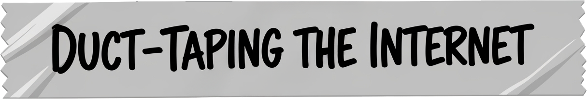
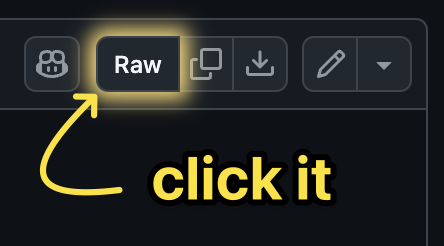

> It’s not pretty, it's practical.

# Userscripts

A grab-bag of scripts to alter, improve, or generally unfudge websites that should know better.

I use Tampermonkey so... these are only tested on that. Your mileage may vary with other managers.

## The scripts

- [CodePen.md - Copy as Markdown](/scripts/codepen-md/) - One-click (or hotkey) CodePen→Markdown: HTML/CSS/JS fences with optional attribution; raw or compiled output (SCSS→CSS, TS/Babel→JS); customizable shortcut; persistent preferences.

## Names I almost used for this repo

- Confuserscripts 🤨
- Abuserscripts 👾
- Misuserscripts 🚩

## External profiles

This [repository](https://github.com/AstroMash/userscripts) will always be the canonical source for these scripts, but you can also find them on:

- [Greasy Fork](https://greasyfork.org/en/users/1449331-astromash)

## Installation (90-second version)

1. Install a userscript manager:
    - ⭐️ [Tampermonkey](https://www.tampermonkey.net/)
    - [Violentmonkey](https://violentmonkey.github.io/)
    - [Greasemonkey](https://www.greasespot.net/) (Firefox)
2. Find a script in this repo → open the **Raw** `user.js`. \
    
3. Your manager should prompt you (probably) → **Install** → done.
4. If it explodes, my bad. If it works, you’re welcome.

## What this is (and isn’t)

- ✅ Small, focused fixes and quality-of-life bandaids.
- ✅ Utilities for common annoyances.
- ✅ Stuff I actually use.
- ❌ Guaranteed to work.

## Contributing

PRs are always welcome. Or if you’ve got an idea but not the code, open an issue with:

- URL(s)
- What annoys you
- What “fixed” looks like

## Trust, but verify

Scripts are “as is,” warranty sold separately. Read them before installing. Some general things to look for when reviewing scripts:

- Look for `@require` lines to see if they pull in external libraries (and which ones).
- Check for `@resource` lines to see if they load external resources (and which ones).
- Look for `@connect` lines to see which domains they can make requests to.
- Check for `@match` or `@include` lines to see which sites they run on.
- Look for `@grant none` (good), `@grant unsafeWindow` (use with caution), or `@grant GM_xmlhttpRequest` (use with extreme caution).
- Look for `eval(` (nope), wild `fetch` to mystery domains (double nope), and unnecessary permissions.
- If you come across something broken, sketchy, or that you don’t understand in one of my scripts, please open an issue or PR. I promise that I will try to remember to fix it.

## License

This project is licensed under the [MIT License](LICENSE). Go forth and slap some duct tape on stuff.

## Disclaimer

This project is not affiliated with any of the websites or services that the userscripts modify. Use at your own risk. The scripts are provided "as is" without warranty of any kind, either express or implied. Always review the code before installing any userscript. You never know what kind of shenanigans my brain might come up with when I'm not looking.
